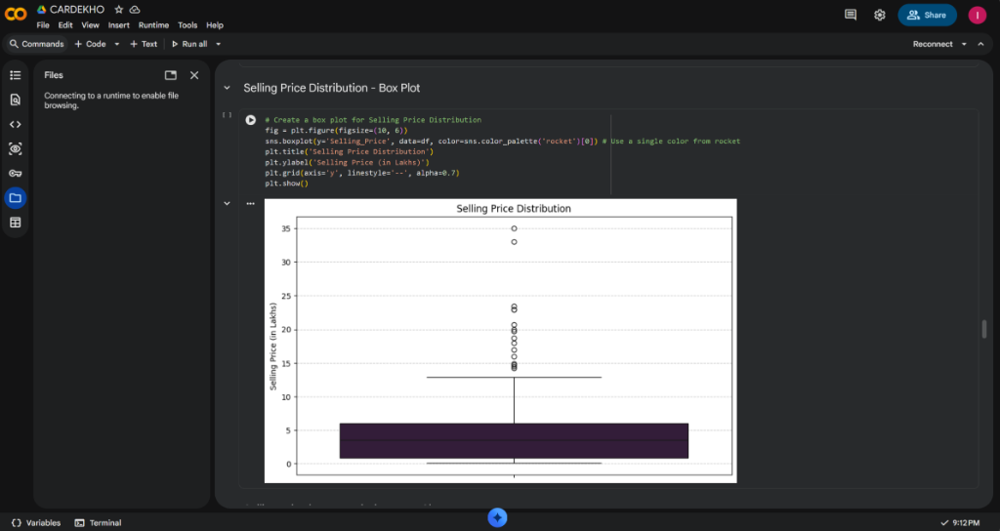

# 🚗 Car Market Trends Analysis with CarDekho Data

[](https://www.python.org/)
[](https://colab.research.google.com/drive/1X3w5meFC9RS5fi0a3PGsbcmUGJ22le5m?usp=sharing)
[](LICENSE)

---

## 📌 Student & Submission Details
* **Student Name:** Indulekha Sagampalli
* **College Name:** Jawaharlal Nehru New College Of Engineering (JNNCE)
* **USN:** `4JN24CD014`
* **AICTE ID:** `STU6a68cd1bc7bd01785253147`
* **Domain:** Data Analytics / Data Visualization

---

## 📖 Project Overview
The pre-owned car market is influenced by numerous interconnected factors including vehicle age, original showroom price, cumulative kilometers driven, fuel type, transmission system, seller category, and prior ownership. 

This project performs an end-to-end **Exploratory Data Analysis (EDA)** and **Market Trend Analysis** on the CarDekho dataset using Python, Pandas, Matplotlib, and Seaborn. The objective is to extract data-driven market patterns that help buyers, sellers, and automotive dealerships evaluate fair vehicle resale pricing.

---

## 🎯 Problem Statement
Estimating the fair market resale price of a used automobile is challenging due to complex depreciating and non-linear factors. Raw data alone does not readily showcase how vehicle age, fuel choice, transmission type, or dealer involvement affect valuations. 

This study leverages data cleaning, statistical modeling, and rich visual analytics to:
1. Identify major variables driving vehicle depreciation.
2. Uncover pricing disparities between fuel and transmission types.
3. Provide actionable insights for buyers, individual sellers, and automotive dealerships.

---

## 👥 Target End Users
1. **Used Car Buyers:** Make data-backed purchasing choices and identify vehicles offering the best value for money.
2. **Individual Sellers:** Set competitive yet profitable selling prices based on market norms.
3. **Pre-Owned Car Dealerships:** Optimize inventory pricing strategies and improve turnover rates.
4. **Automotive Market Analysts:** Study consumer trends, fuel preference transitions, and depreciation curves.

---

## 🛠️ Technology Stack
* **Language:** Python 3.x
* **Data Processing & Manipulation:** `pandas`, `numpy`
* **Data Visualization:** `matplotlib`, `seaborn` (using the *rocket* color aesthetic)
* **Development Environment:** Google Colab & Jupyter Notebook

---

## 📂 Dataset Description
The dataset contains historical listings with 9 original features:
* `Car_Name`: Brand and model designation of the vehicle.
* `Year`: Year of manufacture.
* `Selling_Price`: Resale price of the vehicle (in Lakhs INR).
* `Present_Price`: Current ex-showroom price of the vehicle (in Lakhs INR).
* `Kms_Driven`: Cumulative distance traversed (in kilometers).
* `Fuel_Type`: Fuel category (`Petrol`, `Diesel`, `CNG`).
* `Seller_Type`: Sales intermediary (`Dealer`, `Individual`).
* `Transmission`: Gear transmission type (`Manual`, `Automatic`).
* `Owner`: Number of previous owners (0, 1, 3).

---

## 🧹 Data Cleaning & Preprocessing Pipeline
1. **Missing Value Audit:**
   * Checked all 9 columns for null or missing values (`df.isnull().sum()`).
   * Result: Zero missing values across the entire dataset.
2. **Duplicate Record Detection:**
   * Detected and removed **2 duplicate rows** (`df.drop_duplicates(inplace=True)`).
   * Dataset streamlined from **301 records** to **299 unique records**.
3. **Data Type Verification:**
   * Confirmed numeric and categorical types.
4. **Feature Engineering:**
   * Derived `Car_Age` (`2024 - df['Year']`).
   * Created distance bins: `Kms_Driven_Bins` (`0-20K`, `20K-40K`, `40K-60K`, `60K-80K`, `80K-100K`, `>100K`).
   * Created price brackets: `Present_Price_Bins` (5-Lakh intervals).

---

## 📊 Exploratory Data Analysis & Visualizations
The analysis includes 12 focused visual studies:

1. **Cars by Fuel Type (Pie Chart):**
   * Petrol represents **~79.9%** of available listings, followed by Diesel (**~19.4%**) and CNG (**~0.7%**).
2. **Average Selling Price by Fuel Type (Bar Chart):**
   * Diesel cars command a much higher average resale price (~10.2 Lakhs) compared to Petrol (~3.2 Lakhs) and CNG (~3.1 Lakhs).
3. **Present Price vs Selling Price by Fuel Type (Grouped Bar Chart):**
   * Examines price retention across 5-Lakh price brackets stratified by fuel type.
4. **Kilometers Driven vs Selling Price (Scatter Plot):**
   * Visualizes depreciation versus mileage. Cars with lower mileage hold the highest resale values.
5. **Average Selling Price by Kilometers Driven Ranges (Column Chart):**
   * Demonstrates the drop in resale value across mileage buckets (`0-20K`, `20K-40K`, `40K-60K`, `60K-80K`, `80K-100K`, `>100K`).
6. **Selling Price Trend by Manufacturing Year (Line Chart):**
   * Demonstrates a strong upward trend in resale value for newer models, with recent models (2015-2018) appreciating significantly.
7. **Selling Price Distribution (Box Plot):**
   * Details the median resale price (~3.5 Lakhs), interquartile range (IQR), and luxury outliers above 20-35 Lakhs.
8. **Average Selling Price by Transmission Type (Bar Chart):**
   * Automatic vehicles fetch an average price of ~8.5 Lakhs compared to ~3.9 Lakhs for Manual transmission cars.
9. **Distribution of Cars by Seller Type (Donut Chart):**
   * Dealers account for **88.4%** of listings, while direct individual sellers represent **11.6%**.
10. **Car Age Distribution (Histogram with KDE):**
    * Most vehicles in the market are between **7 to 11 years old**, peaking at ~9-10 years.
11. **Correlation Matrix of Numerical Features (Heatmap):**
    * Highlights a very strong positive correlation between `Present_Price` and `Selling_Price` (**r = 0.88**).
    * `Year` correlates positively (**r = 0.23**) with selling price, while `Kms_Driven` exhibits a slight negative correlation.
12. **Top 10 Most Expensive Car Models (Horizontal Bar Chart):**
    * Identified top models by average selling price: *Land Cruiser, Fortuner, Innova, Creta, Elantra, Vitara Brezza, Ciaz, City, Corolla Altis, and Ertiga*.

---

## 💻 Example Visualization on Google Colab

[](https://colab.research.google.com/drive/1X3w5meFC9RS5fi0a3PGsbcmUGJ22le5m?usp=sharing)

> **Interactive Notebook:** You can view, execute, and reproduce all visualizations directly in the browser via [Google Colab](https://colab.research.google.com/drive/1X3w5meFC9RS5fi0a3PGsbcmUGJ22le5m?usp=sharing).

[](https://colab.research.google.com/drive/1X3w5meFC9RS5fi0a3PGsbcmUGJ22le5m?usp=sharing)

*Figure: Executing the Selling Price Distribution Box Plot inside [Google Colab](https://colab.research.google.com/drive/1X3w5meFC9RS5fi0a3PGsbcmUGJ22le5m?usp=sharing).*

---

## 💡 Key Results & Insights
* **Present Price is the Strongest Predictor:** Showroom value (`Present_Price`) strongly governs resale value (`r = 0.88`).
* **Diesel & Automatic Premiums:** Despite Petrol dominating market volume (79.9%), Diesel and Automatic vehicles command substantial resale premiums.
* **Depreciation Inflexion:** Vehicle depreciation accelerates noticeably after 5-6 years of vehicle age or beyond 60,000 km.
* **Dealer Dominance:** The pre-owned market is heavily commercialized, with authorized dealers facilitating nearly 90% of vehicle sales.

---

## 🚀 How to Run the Project

### 1. Run in Google Colab (Recommended)
Open the interactive Google Colab notebook directly:
👉 [**Launch Google Colab Notebook**](https://colab.research.google.com/drive/1X3w5meFC9RS5fi0a3PGsbcmUGJ22le5m?usp=sharing)

### 2. Run Locally
```bash
# Clone this repository
git clone https://github.com/indulekha0606S/VOIS_MINI-PROJECT-Car-Market-Trends-Analysis.git

# Navigate into the project directory
cd VOIS_MINI-PROJECT-Car-Market-Trends-Analysis

# Install dependencies
pip install -r requirements.txt

# Launch Jupyter Notebook
jupyter notebook CARDEKHO.ipynb
```

---

## 📁 Repository Structure
```
VOIS_MINI-PROJECT-Car-Market-Trends-Analysis/
├── assets/
│   └── colab_visualization_example.png                                # Google Colab execution preview
├── 1776311302-P3-Car Market Trends Analysis with Car Dekho Data.csv   # Project Dataset
├── CARDEKHO.ipynb                                                     # Colab / Jupyter Notebook
├── AICTE_ID_STU6a68cd1bc7bd01785253147_Indulekha_Sagampalli.pptx     # Submission Slide Deck
├── requirements.txt                                                   # Project dependencies
├── .gitignore                                                         # Git ignore rules
└── README.md                                                          # Project documentation
```

---

## 📜 License
This project is licensed under the MIT License.
